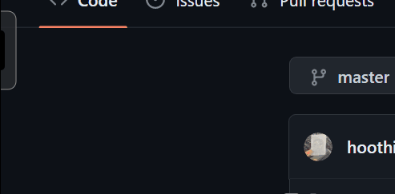

# Rust Clock
[](https://github.com/hoothin/RustClock/releases) [](https://github.com/hoothin/RustClock/releases)

Clock popup every half hour. Build with [rust](https://github.com/rust-lang/rust)|[egui](https://github.com/emilk/egui/)|[rodio](https://github.com/RustAudio/rodio)|[tray-icon](https://github.com/tauri-apps/tray-icon)|[chrono](https://github.com/chronotope/chrono)|[rust-ini](https://github.com/zonyitoo/rust-ini)
> 每隔半小時彈出一次的桌面時鐘


# Config
Edit the conf.ini beside rust_clock.
> 編輯可執行文件旁的 conf.ini。
+ time
> The time when rust clock will popup, set by `hour:minute:second`. Split multi-time by `,`.
> 
> 設置 rust clock 彈出的時刻，使用 `時:分:秒` 的格式，多個時刻使用 `,` 分隔。
``` ini
# popup every half hour per clock
# 每個鐘頭的 30 分鐘彈出
time=:30:
```
``` ini
# popup every half hour and every beginning of minute in 15 o'clock
# 每個鐘頭的 30 分鐘與 15 點整彈出
time=:30:,15::0
```
+ sound
> The sound file you wish to play when clock popup.
>
> 彈出時播放的音效文件
``` ini
# play sound.ogg when popup
# 彈出時播放同目錄下的 sound.ogg 文件
sound=sound.ogg
```
``` ini
# play assets/1.mp3 when reaches first time you set，play assets/2.mp3 when reaches second time you set.
# 設定的第一個報時播放 assets/1.mp3，設定的第二個報時播放 assets/2.mp3
sound=assets/1.mp3|assets/2.mp3
```
``` ini
# Increase the countdown sound effect on the above basis, play assets/3.mp3 when reaches first countdown you set，play assets/4.mp3 when reaches second countdown you set.
# 在上面的基礎上區分倒計時音效，第一個倒計時播放 assets/3.mp3，第二個倒計時播放 assets/4.mp3
sound=assets/1.mp3|assets/2.mp3*assets/3.mp3|assets/4.mp3
```
+ countdown
> The countdown time, set by `hour:minute:second`. Split multi-time by `,`.
>
> 倒計時，使用 `時:分:秒` 的格式，多個倒計時使用 `,` 分隔。
``` ini
# 20-20-20 Rule 護眼法則
countdown=:20:,::20
```
+ pos
> The position where will rust clock popup.
>
> rust clock 的彈出位置。
``` ini
# popup from right side of screen, 20% top of screen height.
# 在屏幕右側彈出，彈出位置距離屏幕頂部 20% 高度
pos=right,20%
```
