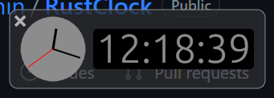

# Rust Clock


Clock popup every half hour. Build with [rust](https://github.com/rust-lang/rust)|[egui](https://github.com/emilk/egui/)|[rodio](https://github.com/RustAudio/rodio)|[tray-icon](https://github.com/tauri-apps/tray-icon)


# Config
Edit the conf.ini with rust_clock.
+ time
> The time when rust clock will popup, set by `hour:minute:second`. Split multi-time by `,`.
``` ini
# popup every half hour
time=:30:
```
``` ini
# popup every half hour and 15:50:00
time=:30:,15:50:
```
+ sound
> The sound file you wish to play when clock popup.
``` ini
# play sound.ogg when popup
sound=sound.ogg
```
